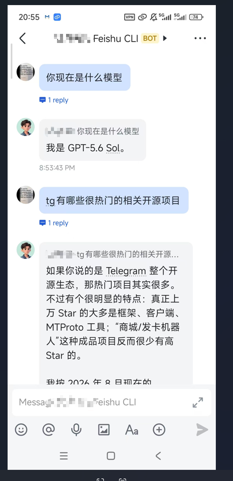
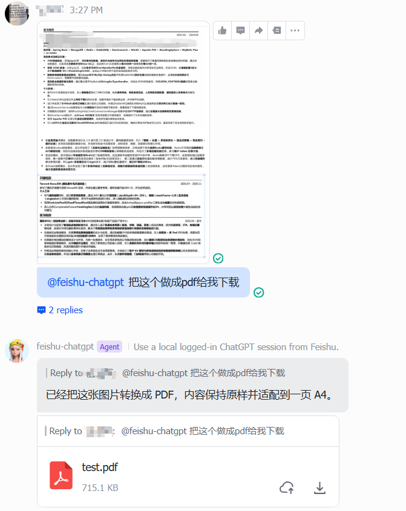

# 用飞书机器人分享你的gpt plus给别人：免反代

[English](README_EN.md) | **简体中文**

把飞书机器人消息转发到本机**已登录的 ChatGPT 网页**，再把网页回答回复回飞书。


同时支持多模态的消息发送



它使用飞书官方 `@larksuiteoapi/node-sdk` 的 WebSocket 长连接，因此不需要公网服务器、域名、Webhook 或 `lark-cli`。

```text
Feishu
  -> Official Feishu WebSocket
  -> Local Node bridge
  -> ws://127.0.0.1:17331
  -> Chrome extension
  -> chatgpt.com
  -> Feishu OpenAPI reply
```

> 这是浏览器自动化实验项目，不使用 OpenAI API。请自行确认你的使用方式符合相关服务条款和组织政策。

## Features

- 群聊中仅在 `@bot` 时响应
- 支持私聊
- 一个飞书会话对应一个 ChatGPT conversation
- `/new` 清空当前飞书会话对应的 ChatGPT 上下文
- 长回答自动拆分后回复飞书
- Chrome Extension 自动重连本地 Bridge
- ChatGPT 会话失效时自动回退到新会话

## Requirements

- Node.js 20+
- Chrome / Chromium
- 一个可创建自建应用的飞书账号
- 浏览器中已登录 `https://chatgpt.com/`

## 1. Install

```bash
git clone <your-repo-url>
cd feishu-chatgpt-bridge
npm install
```

## 2. Create a Feishu bot

推荐直接运行：

```bash
npm run register:feishu
```

它会引导创建一个机器人，并把 App ID / App Secret 写入本地 `.env`。`.env` 已被 Git 忽略。

也可以手工复制配置：

```bash
cp .env.example .env
```

机器人运行至少需要这些消息能力：

```text
im:message.group_at_msg:readonly
im:message.p2p_msg:readonly
im:message:send_as_bot
```

并订阅事件：

```text
im.message.receive_v1
```

在飞书开放平台把事件订阅方式设为**使用长连接接收事件/回调**，然后发布应用版本。若机器人要加入跨企业外部群，还需要在应用发布设置中开启允许机器人用于外部群，并满足飞书对企业认证的要求。

## 3. Load the Chrome extension

打开：

```text
chrome://extensions
```

开启“开发者模式” → “加载已解压的扩展程序” → 选择项目里的 `extension/` 目录。

扩展只连接本机：

```text
ws://127.0.0.1:17331
```

## 4. Run

前台运行：

```bash
npm run check
npm start
```

后台运行：

```bash
npm run start:bg
npm run status
npm run logs
npm run stop
npm run restart:bg
```

运行时文件放在 `.runtime/`，不会提交到 Git。

## Session behavior

Node 端把飞书 `chatId`（私聊时退化为 sender id）作为 `sessionKey` 传给扩展。扩展在 `chrome.storage.local.sessions` 中保存：

```text
sessionKey -> https://chatgpt.com/c/<conversation-id>
```

因此同一个飞书会话会继续之前的 ChatGPT conversation；发送 `/new` 会删除这条映射。

## Security / privacy

公开仓库中不要提交：`.env`、`.runtime/`、Chrome storage 导出、真实飞书用户/群 ID、带账号信息的二维码或调试截图。

如果 App Secret 曾进入 Git 历史，仅删除文件不够；应立即在飞书开放平台轮换 Secret，并清理 Git 历史。

## Project layout

```text
extension/   Chrome MV3 extension，操作已登录的 ChatGPT 页面
src/         飞书 WebSocket、本地 browser bridge、运行时逻辑
scripts/     后台服务与可选的飞书应用注册助手
.env.example 配置模板
```

## Notes

ChatGPT 网页 DOM 可能变化，因此浏览器自动化比正式 API 集成更容易受页面更新影响。遇到回答提取异常时，优先确认 Chrome 扩展已重新加载到仓库中的最新版本。

## 友链

- [LinuxDo](https://linux.do) — 真诚、友善、团结、专业的新生代 AI 社区

## 许可

MIT
